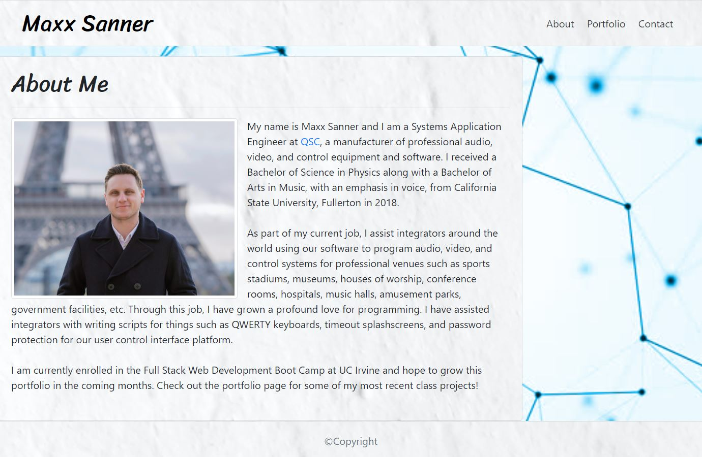

# project 1
UCI Boot Camp Homework 02 - Portfolio

This was the second homework assignment for the full stack web development program at UC Irvine, in which the goal was to build a responsive portfolio website that includes an about page, a portfolio page with links to the deployed applications, and a contact page.

# link to deployed application:
https://maxx105.github.io/portfolio/

# image of deployed application:

# Technologies
For this project, I used HTML and CSS as well as Bootstrap for additional styling.

# Purpose
This is meant to serve as my public facing portfolio website. It will be updated as I continue to produce more projects. It will also provide people with means to contact me.

# How to use: 
Simply navigate between the three pages using the navbar in the upper right corner. On the portfolio page, there are links to the deployed application AND the github repo for each project. On the contact page, you can click on the Github and LinkedIn icons to go to my Github and LinkedIn pages, respectively.

# Coming soon:
I will be adding projects to the portoflio page as I go and will also add functionality to the contact page form.
